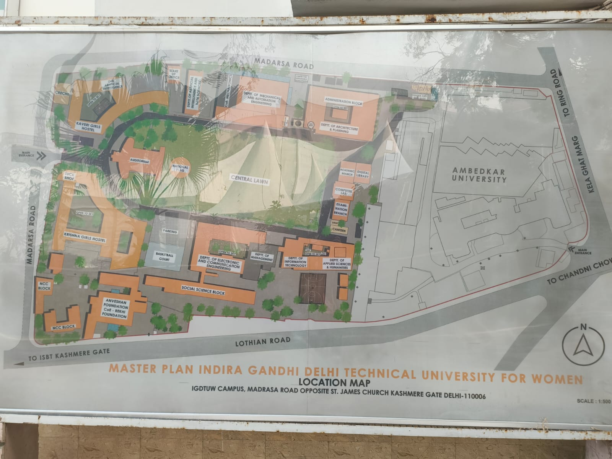

# IGDTUW 3D Campus Map 🌐
## 📍 Campus Overview

Here’s the **Master Plan of Indira Gandhi Delhi Technical University for Women** to give you a quick visual overview of the campus layout:


A fully interactive and immersive **3D campus map** for **Indira Gandhi Delhi Technical University for Women (IGDTUW)**, designed to offer a realistic and detailed virtual tour experience. Built using advanced 3D rendering technologies, this project aims to provide users with a comprehensive and engaging way to explore the IGDTUW campus virtually.

## Table of Contents
- [Features](#-features)
- [Technologies Used](#-technologies-used)
- [Installation Guide](#-installation-guide)
- [Usage Instructions](#-usage-instructions)
- [3D Models and Assets](#-3d-models-and-assets)
- [Contributing](#-contributing)
- [Acknowledgments](#-acknowledgments)
- [Project Structure](#-project-structure)
- [License](#-license)
- [Contact](#-contact)

---

## 🚀 Features

- **Realistic 3D Models**: Created using **Blender** for detailed and accurate campus representation.
- **Interactive Navigation**: Clickable paths and live guidance for real-time navigation across the campus.
- **Building Details**: Hover or click on buildings to see names and descriptions via tooltips and modals.
- **Search Functionality**: Quickly locate buildings using a dynamic search box with suggestions.
- **Day/Night Mode**: Toggle between day and night modes for different lighting experiences.
- **Feedback System**: Share feedback or suggestions directly from the website.
- **Responsive UI**: Fully optimized for desktop, tablet, and mobile devices.

---

## 🔧 Technologies Used

- **Frontend**: HTML, CSS, JavaScript
- **3D Rendering**: Three.js, WebGL
- **3D Modeling**: Blender
- **Animations**: GSAP (GreenSock Animation Platform)
- **Development Tools**: Visual Studio Code, GitHub, npm

---

## 🛠️ Installation Guide

1. **Clone the Repository**:
   ```bash
   git clone https://github.com/your-username/IGDTUW-3D-Map.git
   cd IGDTUW-3D-Map
   ```

2. **Install Dependencies**:
   ```bash
   npm install
   ```

3. **Run Locally**:
   ```bash
   npm start
   ```

4. **Open in Browser**:
   Visit [http://localhost:3000](http://localhost:3000) to explore the 3D map.

---

## 🎨 3D Models and Assets

All 3D models used in this project were crafted with Blender, ensuring precise and high-quality campus structures. The .glb format was utilized for seamless integration with Three.js.

---

## 🤝 Contributing

We welcome contributions from the community to enhance this project further! Here’s how you can get involved:

1. **Fork the Repository**:
   Click on the Fork button in the top-right corner of this page.

2. **Clone the Fork**:
   ```bash
   git clone https://github.com/your-username/IGDTUW-3D-Map.git
   cd IGDTUW-3D-Map
   ```

3. **Create a Feature Branch**:
   ```bash
   git checkout -b feature/your-feature-name
   ```

4. **Make Changes and Commit**:
   ```bash
   git add .
   git commit -m "Add your feature"
   ```

5. **Push to GitHub**:
   ```bash
   git push origin feature/your-feature-name
   ```

6. **Submit a Pull Request**:
   Open a pull request describing your changes.

---

## 📜 Acknowledgments

This project has been a collaborative effort with contributions from several talented individuals. Special thanks to:

### Deepak Gupta - [LEAD DEVELOPER & PROJECT ADMIN](https://github.com/divi-24)
The visionary behind this project, responsible for overseeing the development, structuring, and implementation of core features.

---

### Team Coding
The Coding team has been instrumental in writing the main code for this project, ensuring a seamless user experience.

- **CHHAVI** - [](https://github.com/chhavibhalla)
- **SHANJAN(TEAM HEAD)** - [](https://github.com/shnjnmkkr) 
- **TUSHAR** - [](https://github.com/tusharsinghbisht)
- **HITANSHA** - [](https://github.com/Hits-p)
- **PALAK** - [](https://github.com/PalakChadha27)
- **AYATI** - [](https://github.com/Ayati-G)
- **ANISHA** - [](https://github.com/AnishaGupta-tech)
- **MUSKAN** - [](https://github.com/MuskanPhogat2024)

---

### Team Blender
The Blender team worked on creating the 3D models that bring this campus map to life.

- **PRIYANSHI(TEAM HEAD)** - [](https://github.com/panshilovesicecream)
- **NISHTHA** - [](https://github.com/nishtha-22)
- **ARIZA** - [](https://github.com/aziraxariza)
- **PURVA** - [](https://github.com/Antarctica1234)
- **AADHYA** - [](https://github.com/aadhyaavermaa)
- **DIVYANSH** - [](https://github.com/Lordvaderani)
- **ANUSHKA** - [](https://github.com/anushkayadav0901)
- **ADITYA** - [](https://github.com/estrizal)
- **RAKSHITA** -[](https://github.com/rakshitatagra)

---

### Team Pictures and Animation
The Pictures and Animation team enhanced the visual appeal of the project through stunning images and smooth animations.

- **CHHAVI(TEAM HEAD)** - [](https://github.com/chhavibhalla)
- **SUNANDITHA** - [](https://github.com/4563kr)
- **PURVA** - [](https://github.com/Antarctica1234)


---

And a huge shoutout to the open-source community for their support and tools like **Three.js**, **GSAP**, and **Blender**, which made this project possible! 🎉

---

### Want to See Your Name Here?
Contribute to the project and be part of the acknowledgment section! 🌟

## 📂 Project Structure

```
IGDTUW-3D-Map/
├── models/             # 3D models in .glb format
├── assets/             # Images, icons, and static assets
├── css/                # Styling files
├── js/                 # JavaScript for interactivity
├── index.html          # Main HTML file
├── README.md           # Project documentation
├── .gitignore          # Git ignored files
└── package.json        # npm configuration
```

---

## 📄 License

This project is licensed under the MIT License. You’re free to use, modify, and distribute it. Refer to the LICENSE file for more details.

---

## 📧 Contact

For queries or collaboration opportunities, feel free to reach out to:
- Deepak Gupta
  - GitHub: [divi-24](https://github.com/divi-24)
  - Email: divi2749@gmail.com

Let’s build a community-driven project and make this the go-to platform for exploring IGDTUW virtually! 🚀✨
``
